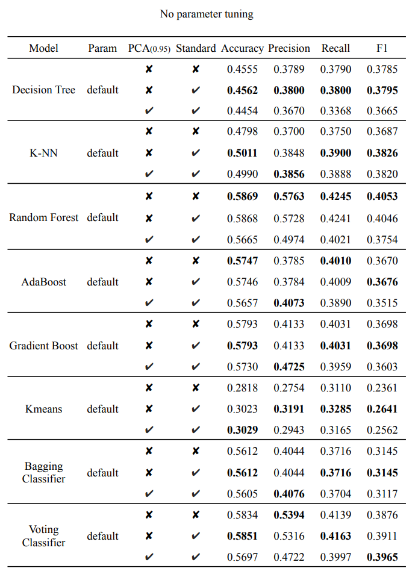
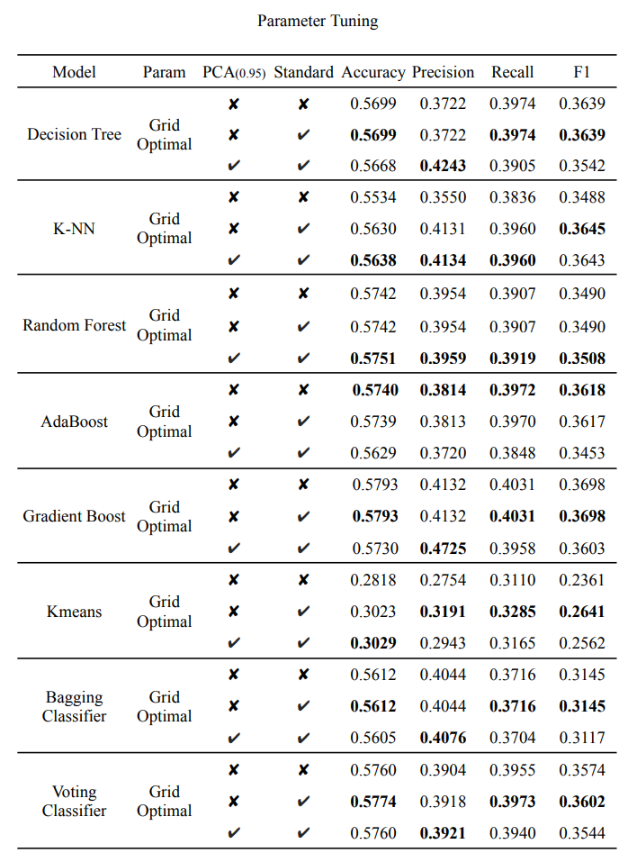
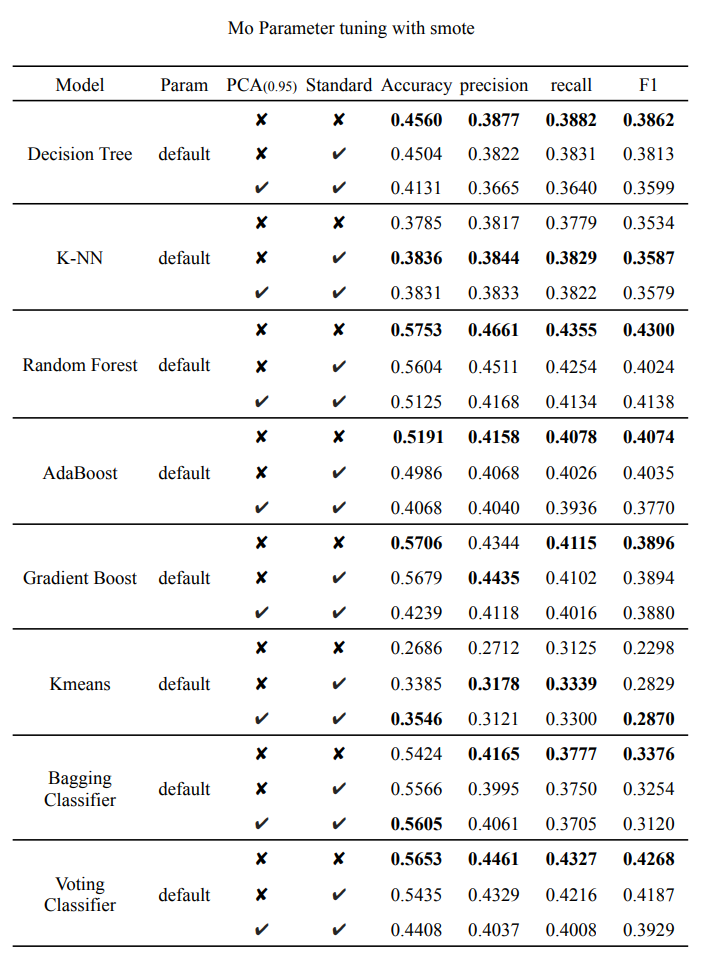
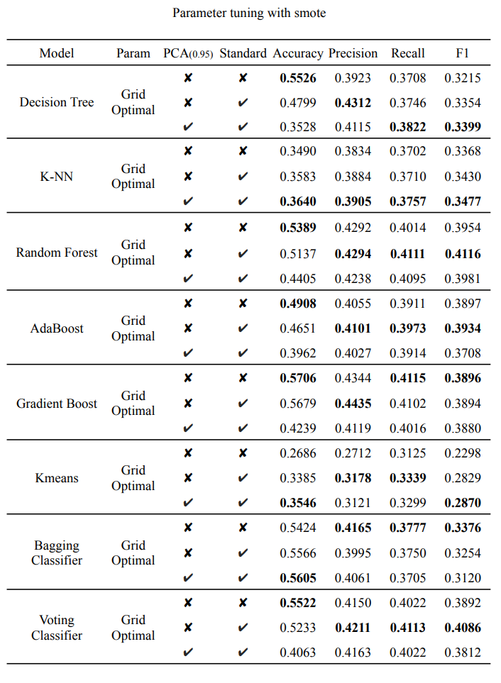

# Predict Korean Mountain Fire Damage
*Gachon University - 2023 Data Science Final Projects*  
The goal of this project was to experience the *Big Data End-to-End Process*, which can predict the extent of damage if a fire breaks out in a forest in Korea. 
## Models
- Decision Tree
- K-Nearest Neighbors
- Random Forest
- AdaBoost
- Gradient Boosting
- Voting Classifier
- Bagging Classifier with Decision Tree Stump
- K-Means Clustering

## Requirements
```
$ pip install -r requirment.txt
```
## Usage & Parameters
To prepare a dataset for training, you need to merge the datasets.
```
$ python .\dataset\preprocess\create_dataset.py
```
The experiment will be customized to your configuration.
```
$ python evaluate.py
```
#### Parameters
- `data_path`: str.  
The path to the dataset for training and testing.
- `param_path`: str.  
The path to the file where all configuration and parameters are written.
- `seed`: int.  
*random_state*, a random seed. 
- `redirector`: bool.  
Whether to log learning results.
- `visual`: bool.  
Visualize learning outcomes
- `model`: str.  
Models to use for training
`'dt'(decision tree), 'lr'(logistic regression), 'knn'(k-nearest neighbors), 'rf'(random forest),
'ab'(AdaBoost), 'gb'(gradient boosting), 'voting' (voting classifier), 'bag' (bagging classifier)
'kmeans' (k-means clustering)`
- `param_load`: bool.  
Whether to load the tuned hyperparameter.
- `voting_list`: list.  
A list of models to include in the Voting Classifier.
- `tune`: str.  
The method for finding `grid`, `random`, `None`, and hyperparameters.
- `n_iter`: int.  
The maximum number of iterations for `random` tuning.
- `cv`: int.  
This is the parameter of the K-Fold when tuning.
- `pca`: bool.  
Whether to use the PCA technique.
- `n_components`: float.  
The minimum explained_variance_ratio in PCA.
- `smote`: bool.  
Data Augmentation, whether to use SMOTE.
- `standard`: bool.  
Whether to apply StandardScaler to the dataset before training.
- `eval`: str.  
Validation technique options are `kfold`, `holdout`, `kfold_stratified`.
- `n_split`: int.  
The number you want to divide by in `kfold`.
- `num_class`: int.  
The number of classes
#### If you want to experiment with all possible cases, run the below
```
$ python all_eval.py
```
## Project Structure
```
23_Data_Science
|   config.py
|   main.py
|   all_eval.py
|   evaluate.py
|   requirements.txt
|   
+---dataset
|   |   Dataset.py
|   |   FireDataset.csv
|   |   preprocessed.csv
|   |   
|   +---Fire
|   |       FireFacility_latlong.csv
|   |       FireStationPos.csv
|   |       FireStation_latlong.csv
|   |       FireStatistic.csv
|   |       FireStatistic_latlong.csv
|   |       MountainHeight.xlsx
|   |       MountainHeight_latlong.csv
|   |       
|   +---preprocess
|   |   |   create_dataset.py
|   |   |   preprocessing.py
|   |   |   
|   |   +---functions
|           
+---logs
|       stdout_2023-06-04_13_47_25.txt
|       
+---models
|   |   model.py
|   |   
|   +---config
|   |       ab_range.txt
|   |       dt_range.txt
|   |       gb_range.txt
|   |       knn_range.txt
|   |       lr_range.txt
|   |       rf_range.txt
|   |       voting_range.txt
|           
+---tools      
```
## Experiments
<p align="center"></p>
<p align="center"></p>
<p align="center"></p>
<p align="center"></p>
